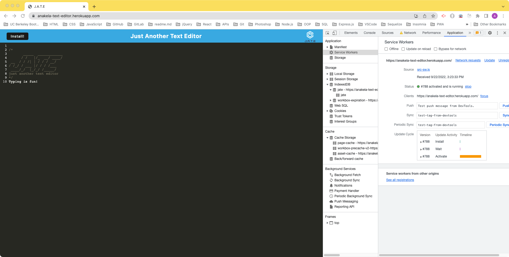

# Challenge 19 - Progressive Web Applications (PWA): Text Editor

## Table of Contents

- [Overview](#overview)
  - [The Challenge](#the-challenge)
  - [User Story](#user-story)
  - [Acceptance Criteria](#acceptance-criteria)
  - [Screenshot](#screenshot)
  - [Links](#links)
- [My Process](#my-process)
  - [Built With](#built-with)
  - [What I Learned](#what-i-learned)
  - [Continued Development](#continued-development)
  - [Useful Resources](#useful-resources)
- [Author](#author)
- [Acknowledgments](#acknowledgments)

## Overview

### The Challenge

>As you have progressed through this course, you have put together a number of impressive projects that you can show off to potential employers. This project is no exception; in fact, it features some of the most impressive expressions of the concepts you have learned so far.
>
>Your task is to build a text editor that runs in the browser. The app will be a single-page application that meets the PWA criteria. Additionally, it will feature a number of data persistence techniques that serve as redundancy in case one of the options is not supported by the browser. The application will also function offline.
>
>To build this text editor, you will start with an existing application and implement methods for getting and storing data to an IndexedDB database. You will use a package called `idb`, which is a lightweight wrapper around the IndexedDB API. It features a number of methods that are useful for storing and retrieving data, and is used by companies like Google and Mozilla.
>
>You will deploy this full-stack application to Heroku using the [Heroku Deployment Guide on The Full-Stack Blog](https://coding-boot-camp.github.io/full-stack/heroku/heroku-deployment-guide).

### User Story

```md
AS A developer
I WANT to create notes or code snippets with or without an internet connection
SO THAT I can reliably retrieve them for later use
```

### Acceptance Criteria

```md
GIVEN a text editor web application
WHEN I open my application in my editor
THEN I should see a client server folder structure
WHEN I run `npm run start` from the root directory
THEN I find that my application should start up the backend and serve the client
WHEN I run the text editor application from my terminal
THEN I find that my JavaScript files have been bundled using webpack
WHEN I run my webpack plugins
THEN I find that I have a generated HTML file, service worker, and a manifest file
WHEN I use next-gen JavaScript in my application
THEN I find that the text editor still functions in the browser without errors
WHEN I open the text editor
THEN I find that IndexedDB has immediately created a database storage
WHEN I enter content and subsequently click off of the DOM window
THEN I find that the content in the text editor has been saved with IndexedDB
WHEN I reopen the text editor after closing it
THEN I find that the content in the text editor has been retrieved from our IndexedDB
WHEN I click on the Install button
THEN I download my web application as an icon on my desktop
WHEN I load my web application
THEN I should have a registered service worker using workbox
WHEN I register a service worker
THEN I should have my static assets pre cached upon loading along with subsequent pages and static assets
WHEN I deploy to Heroku
THEN I should have proper build scripts for a webpack application
```

### Screenshot





### Links

- Solution URL: [https://github.com/anakela/pwa-text-editor](https://github.com/anakela/pwa-text-editor)
- Live Site URL: [https://anakela-text-editor.herokuapp.com/](https://anakela-text-editor.herokuapp.com/)

## My Process

### Built With

- NodeJS
- ExpressJS
- Webpack
- Workbox
- IndexedDB

### What I Learned

During this challenge, I discovered that when I worked with webpack, I had to delete the `dist` folder and run `npm run build` after making changes in order to troubleshoot errors.  Before doing this, I found that even after I troubleshot errors, they would still appear due to caching.

Additionally, I learned that I can use Chrome's Application > Storage area to clear site data before rerunning an application such as `J.A.T.E`, and then restart `J.A.T.E` using `npm run start:dev`.  This helped to clear out errors from the cache after making code changes.

Lastly, I added a line of code at the top of my `getDB` function in `database.js` that read as follows:

```JavaScript
console.error('getDb not implemented`);
```

I found that this line kept displaying an error in the browser even where an error did not occur.  Once I removed this line, the application seemed to work correctly.

### Continued Development

In the future, I would like to learn more about webpack in general.  Admittedly, I still find it quite confusing and daunting.  However, with practice, I hope to better understand all the amazing things it can do!

### Useful Resources

- [CodeMirror](https://codemirror.net/5/mode/javascript/)
- [iDB: 3 ways to delete Chrome apps on Mac](https://www.idownloadblog.com/2022/07/04/how-to-delete-chrome-apps-on-mac/)
- [MDN Web Docs: Using IndexedDB](https://developer.mozilla.org/en-US/docs/Web/API/IndexedDB_API/Using_IndexedDB)

## Author

If you have any questions or experience any technical difficulties, please feel free to contact me on GitHub or LinkedIn.

- GitHub - [https://github.com/anakela](https://github.com/anakela)
- LinkedIn - [https://www.linkedin.com/in/anakela/](https://www.linkedin.com/in/anakela/)

## Acknowledgments

- Fellow Bootcampers:
  - Nolan Spence
  - Asha Chakre
- Scott Nelson (TA)
- Bobbi Tarkany (Tutor)